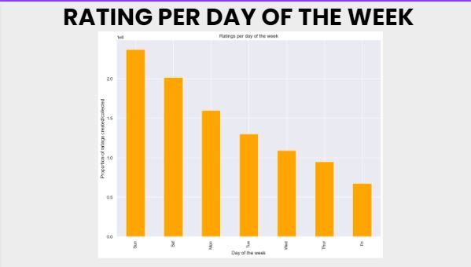
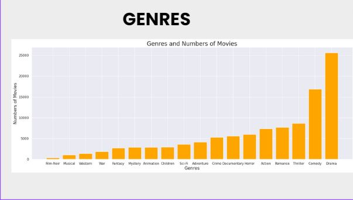

# Streamlit-based-Recommender-System

# Elevating Customer Retention Through the Integration of a Sophisticated Movie Recommender System 🎬🌟

## Overview
Recommender systems serve as indispensable components in our contemporary technological landscape, playing a pivotal role in diverse domains such as search engines, online shopping, streaming multimedia platforms, and news feeds. These services rely on recommendation algorithms to deliver tailored content, ensuring user engagement with desired materials.

Fundamentally, recommender systems function by establishing connections through similarity, aligning users with relevant items. The primary methodologies employed in recommender systems include content-based and collaborative-based filtering. Content-based filtering assesses similarity between items based on their inherent properties, while collaborative filtering leverages user similarities to generate recommendations.

While undergoing the learning phase at ExploreAI Academy, I had the privilege of delving into the intricacies of enhancing a concise overview, delving into both the theoretical foundations and practical applications of recommendation algorithms.

# Objectives
- Cinematic Behavioral Analysis: Uncover user movie-watching patterns for a nuanced understanding.
- Advanced Recommender Engine Development: Engineer a cutting-edge movie recommender system for refined user experiences.
- Intuitive Movie App Design: Create a visually appealing, user-centric app seamlessly integrating our recommendation system.
- Transparent Stakeholder Reporting: Present insights clearly, showcasing the tangible value of our cinematic discovery.

# Tools and Technology
- Development Language: Python 🐍
- Web Application Framework: Streamlit 🧙‍♂️
- Machine Learning Libraries: Utilizing scikit-learn and nltk 📚
- Experiment Tracking: Employing Comet for systematic recording 📜
- Version Control System: GitHub for collaborative version management 🧹
- Cloud Infrastructure: Leveraging AWS EC2 with S3 bucket for scalable cloud architecture ☁️

# My Role
## As the Technical Lead of a dynamic team of five, I played a pivotal role in the project, contributing in the following key areas:
* Created a secure virtual environment using an EC2 instance on AWS.
* Led the development of a user-friendly Streamlit-based Recommender System for an intuitive user experience.
* Contributed to the development of the Collaborative-Based Algorithm, shaping the project's core functionality.
* Orchestrated the deployment of the Web Application on AWS, leveraging its scalability and reliability.
* Presented the Web Application to stakeholders and the wider audience, effectively communicating project outcomes, features, and impact.

# Project Highlights
Here are some of the project highlights:
## Snapshot of Top User Ratings

Analysis of the highest-rated movies each day of the week reveals a notable trend: on average, movies tend to garner more ratings on Sundays and Saturdays. This pattern underscores the significance of these two days in driving rating activity. A plausible explanation for this phenomenon is the widespread preference for watching movies during weekends, either at home or in cinemas, leading to an uptick in rating activity on Saturdays and Sundays.

## Movie Genries

Upon analyzing the dataset, distinct genre preferences among viewers emerge. The predominant genres are Drama and Comedy, exerting a notable influence on the dataset. Following closely behind are Thriller, Romance, and Action genres. In contrast, Musical and Film-Noir genres exhibit the lowest representation, signaling a pronounced inclination towards Drama and Comedy movies among users.

# Application Demonstration
Introducing a comprehensive visual overview of our application, **Moviepedia**, through an insightful video demonstration.

## Recommendations
**Optimize Content for Weekends:**
- Capitalize on the higher movie ratings observed on Saturdays and Sundays by optimizing content delivery or promotional activities during these days.
**Content Emphasis on Popular Genres:**
- Focus on promoting and recommending movies in the most popular genres, such as Drama and Comedy, to enhance user satisfaction and retention.
**Enhance Collaborative-Based Algorithm:**
- Continuously refine and enhance the collaborative-based algorithm for movie recommendations to improve accuracy and relevance.
**Explore Integration with Social Platforms:**
- Investigate the potential integration of social aspects within the recommender system. Social recommendations or sharing features could enhance user engagement and bring a social element to movie discovery.

# Conclusion
 In conclusion, the Moviepedia Recommender System has successfully achieved its objectives by seamlessly integrating theoretical principles with practical applications in recommendation algorithms. Key milestones, including Cinematic Behavioral Analysis, Advanced Recommender Engine Development, and Transparent Stakeholder Reporting, underscore our commitment to excellence. The strategic utilization of sophisticated tools such as Python, Streamlit, and AWS played a pivotal role in shaping the core functionality, emphasizing our team's technical prowess. Noteworthy insights into user behavior, derived from movie ratings and genre preferences as showcased, contribute to a nuanced understanding. Ongoing recommendations for optimization and future enhancements reflect our dedication to continually elevate user experiences and engagement. Collectively, this project signifies a substantial contribution to the progression of recommender systems.
 
 # Acknowledgments
 I express sincere appreciation to my committed team members whose unwavering endeavors have propelled us to achieve our objectives:

 - Esther Akinniyi
 - Shedrack Udeh
 - Sandisiwe Mtsha
 - Al-Morauf Ajasa

